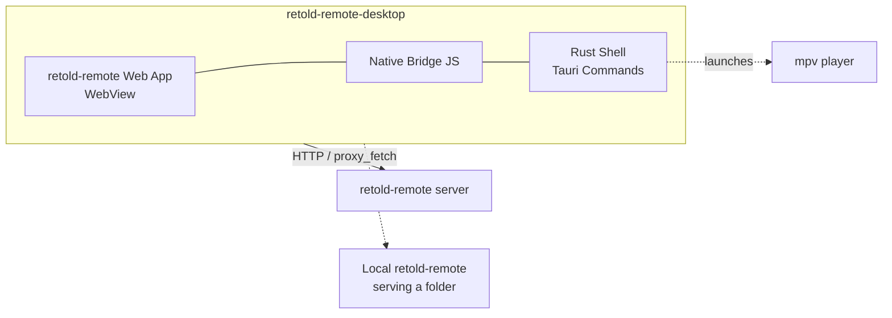

# retold-remote-desktop

> **[Read the Retold-Remote-Desktop Documentation](https://fable-retold.github.io/retold-remote-desktop/)** - interactive docs with the full build and architecture reference.

> A native desktop application for the Retold Remote media browser.

A cross-platform desktop app built with [Tauri 2.0](https://v2.tauri.app/) that wraps the [`retold-remote`](https://github.com/fable-retold/retold-remote) web media browser in a native shell for macOS, Windows, and Linux. It connects to a `retold-remote` server -- or serves a local folder of media itself -- and adds native conveniences the browser can't: a CORS-free HTTP proxy, a system tray, an application menu, and native video playback through mpv.

Part of the [Retold](https://github.com/stevenvelozo/retold) application suite.

## Prerequisites

- **Node.js 20+** and npm -- for the JavaScript toolchain and the Tauri CLI.
- **Rust** (stable) and Cargo -- Tauri compiles a native Rust binary. Install via [rustup](https://rustup.rs/).
- **Platform build dependencies** required by Tauri -- see the [Tauri prerequisites guide](https://v2.tauri.app/start/prerequisites/) (Xcode Command Line Tools on macOS, WebView2 + MSVC build tools on Windows, `libwebkit2gtk` and friends on Linux).
- **mpv** (optional, recommended) -- for native video playback. `brew install mpv` on macOS, or your platform's package manager.
- A built copy of [`retold-remote`](https://github.com/fable-retold/retold-remote)'s web bundle checked out as a sibling directory, so its web assets can be copied into `web-app/` (see below).

## Install

From source:

```bash
git clone https://github.com/fable-retold/retold-remote-desktop
cd retold-remote-desktop
npm install
```

Sync the `retold-remote` web bundle into `web-app/` (requires a built `retold-remote` checkout beside this one):

```bash
npm run copy-web-app
```

## Run

```bash
npm run dev
```

This launches `tauri dev`, which compiles the Rust shell and opens a native window loading the `web-app/` frontend with live reload.

## Architecture at a Glance



- **Web layer** -- the unmodified `retold-remote` Pict application, loaded from `web-app/`.
- **Native bridge** (`web-app/retold-native-bridge.js`) -- a small script that loads before the app: detects the platform, shows a connection screen, rewrites API/content URLs, proxies requests through Rust to bypass CORS, and intercepts media for native playback.
- **Rust shell** (`src-tauri/`) -- the Tauri binary: an HTTP proxy command, an embedded-server manager, an mpv controller, a system tray, and the application menu.

## Highlights

- Wraps the `retold-remote` browser bundle with **zero changes** to the web app.
- **CORS-free networking** -- a Rust `proxy_fetch` command relays API and content requests so the WebView can reach any `retold-remote` server.
- **Serve a local folder** -- the app can spawn a `retold-remote` server pointed at a folder you pick, no separate server required.
- **Native video playback** -- a three-tier strategy: embedded libmpv (macOS), external mpv process, then browser fallback, with keyboard transport controls.
- **System tray and native menu** -- show/hide, quit, connect/disconnect, open local folder, and developer tools.
- **Single shared codebase** with the [`retold-remote-ios`](https://github.com/fable-retold/retold-remote-ios) client -- the same native bridge detects Tauri vs. Capacitor at runtime.

## Scripts

| Script | What it does |
|---|---|
| `npm run dev` | Run the app in development with live reload (`tauri dev`) |
| `npm run build` | Build a production bundle for the current platform (`tauri build`) |
| `npm run build-mac` | Build a universal macOS bundle (`--target universal-apple-darwin`) |
| `npm run build-win` | Build a Windows MSI installer (`--bundles msi`) |
| `npm run build-linux` | Build Linux `.deb` and AppImage bundles |
| `npm run copy-web-app` | Sync `retold-remote` web assets into `web-app/` |
| `npm run tauri` | Invoke the Tauri CLI directly |

## Documentation

Full documentation lives in [`docs/`](./docs/) and is published via [pict-docuserve](https://github.com/fable-retold/pict-docuserve):

- [Overview](./docs/overview.md)
- [Quickstart](./docs/quickstart.md)
- [Architecture](./docs/architecture.md)
- [Desktop Build & Package Guide](./docs/desktop-build-and-package.md) -- dev, bundling, and CI for macOS, Windows, and Linux

## Related Modules

| Module | Role |
|---|---|
| [retold-remote](https://fable-retold.github.io/retold-remote/) | The server and web app this desktop shell wraps |
| [retold-remote-ios](https://fable-retold.github.io/retold-remote-ios/) | Sibling native iOS client (shares the native bridge) |

## License

[MIT](./LICENSE) -- same as the rest of the Retold suite.
