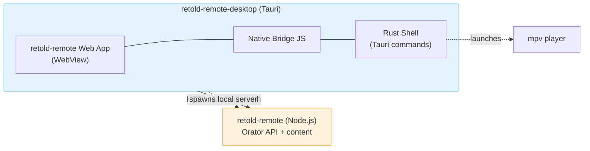

# retold-remote-desktop

> A native desktop application for the Retold Remote media browser.

`retold-remote-desktop` is the [Tauri 2.0](https://v2.tauri.app/) companion to [`retold-remote`](https://fable-retold.github.io/retold-remote/). It wraps the `retold-remote` web media browser in a native shell for macOS, Windows, and Linux, then layers on the things a browser tab can't do: a CORS-free HTTP proxy, native video playback through mpv, a system tray, and a real application menu.

Like the rest of the Retold suite, it treats the server as the source of truth. The desktop app is a *thin native edge* -- it loads the unmodified `retold-remote` web bundle, brokers its network calls through Rust, and otherwise stays out of the way. It can also spawn its own local `retold-remote` server to browse a folder on disk.

## Where It Fits

The app talks to a `retold-remote` server over plain HTTP, but routes those requests through a Rust `proxy_fetch` command so the WebView never hits a CORS wall. Everything authoritative -- the media index, content streaming, thumbnails -- lives on the server.

## Highlights

- **Native Tauri 2.0 shell** for macOS, Windows, and Linux
- **Unmodified web app** -- the `retold-remote` browser bundle is wrapped, never forked
- **CORS-free networking** via a Rust HTTP proxy command
- **Serve a local folder** by spawning an embedded `retold-remote` server
- **Native video playback** -- embedded libmpv (macOS), external mpv, then browser fallback
- **System tray + application menu** for show/hide, connect/disconnect, and playback

## Documentation

The full documentation is published via [`pict-docuserve`](https://fable-retold.github.io/pict-docuserve/). Open `docs/index.html` in a browser, or browse the source Markdown directly:

- **[Overview](overview.md)** -- what the app is, what it isn't, and how it relates to the rest of Retold
- **[Quickstart](quickstart.md)** -- clone, sync web assets, and run a dev build
- **[Architecture](architecture.md)** -- how the web app, native bridge, and Rust shell fit together, with diagrams
- **[Desktop Build & Package](desktop-build-and-package.md)** -- the Tauri build/bundle flow for each platform, plus the CI pipeline

## Related Modules

| Module | Role | Used By |
|---|---|---|
| [`retold-remote`](https://fable-retold.github.io/retold-remote/) | The server and web app this shell wraps | Every feature |
| [`retold-remote-ios`](https://fable-retold.github.io/retold-remote-ios/) | Sibling native iOS client | Shares the native bridge |

## License

MIT -- see the repository `LICENSE` file. The same license as the rest of the Retold suite.

## Contributing

Bug reports and pull requests are welcome in the [retold](https://github.com/stevenvelozo/retold) monorepo. For larger changes -- new native commands, packaging shifts -- please open an issue first so we can talk through the design before you write Rust.
