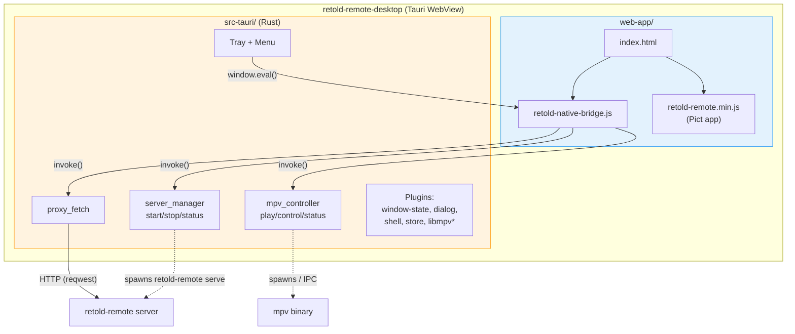
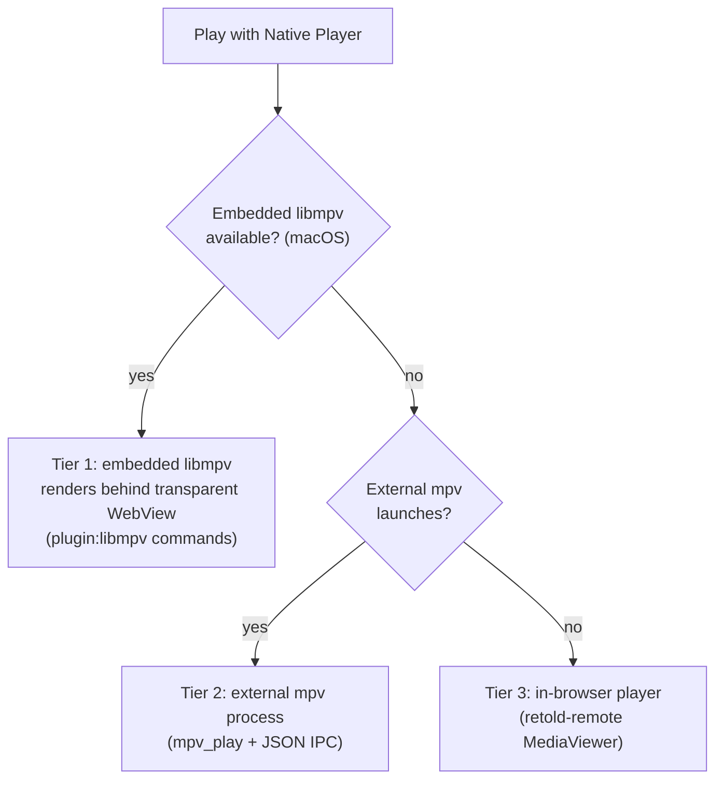

# Architecture

`retold-remote-desktop` is a [Tauri 2.0](https://v2.tauri.app/) application: a native Rust binary that hosts a WebView, into which the unmodified `retold-remote` web app is loaded. A small bridge script glues the web app to the native shell. This page describes those three layers and how a request flows through them.

## Layered Design

1. **Web app** -- the `retold-remote` Pict browser bundle, served from `web-app/` (`frontendDist` in `tauri.conf.json`).
2. **Native bridge** -- `web-app/retold-native-bridge.js`, loaded before the app, which adapts the web app to the native runtime.
3. **Rust shell** -- `src-tauri/`, exposing Tauri commands, a system tray, and the application menu.

The web app is never modified. Everything native is layered on by the bridge (in JavaScript) and the Tauri commands (in Rust).

## Component Diagram



\* libmpv is a macOS-only plugin.

## The Web App Layer

`web-app/index.html` loads the native bridge **first**, then the Pict framework and the `retold-remote` application bundle:

```html
<script src="retold-native-bridge.js"></script>
<script src="js/pict.min.js"></script>
<script src="codejar.js"></script>
<script src="js/jszip.min.js"></script>
<script src="js/epub.min.js"></script>
<script src="retold-remote.min.js"></script>
<script>
	Pict.safeLoadPictApplication(RetoldRemoteApplication, 2);
</script>
```

The `retold-remote.*` bundle and its `js/`, `css/`, and `docs/` assets are not authored here -- they are copied in from a built `retold-remote` checkout by `scripts/copy-web-app.sh` (`npm run copy-web-app`). Only `index.html`, `retold-native-bridge.js`, and `retold-native-bridge.css` are owned by this repository, so re-syncing never clobbers the native integration.

## The Native Bridge

`retold-native-bridge.js` is the heart of the integration. Because it loads before the app and installs its hooks **immediately** (not on `DOMContentLoaded`), the patched networking is in place before `retold-remote` makes its first API call. It provides:

### Platform detection

It sets `window.__RETOLD_NATIVE__` by sniffing globals: `window.__TAURI_INTERNALS__` / `window.__TAURI__` means desktop; `window.Capacitor` means iOS. The same script ships in the [`retold-remote-ios`](https://fable-retold.github.io/retold-remote-ios/) client, so this is how one bridge serves both shells.

### Connection screen and server URL

On launch the bridge reads the last-used server URL from `localStorage`. If present and reachable (verified via `GET /api/media/capabilities`), it loads the app; otherwise it renders a connection overlay with a URL input and a recent-servers list. The active server URL is held in `window.__RETOLD_SERVER_URL__`.

### URL rewriting and the CORS-free proxy

The WebView serves the frontend from a custom Tauri protocol origin, so direct cross-origin requests to the `retold-remote` server would be blocked by CORS. The bridge solves this two ways:

- **Rewrites** relative paths (`/api/`, `/content/`, `/content-hashed/`) to absolute URLs on the configured server, patching `fetch`, `XMLHttpRequest.open`, and the `HTMLImageElement.prototype.src` setter (the last is needed for off-DOM `Image` objects used by tile viewers like OpenSeadragon).
- **Proxies** any request to the server origin through the Rust `proxy_fetch` command instead of issuing it from the WebView. The Rust side (using `reqwest`) has no CORS restrictions; the bridge wraps the `{ status, headers, body }` result back into a fetch-like `Response`.

It also rewrites outbound `tauri.localhost` URLs back to the real server URL for `window.open` and `shell.open`, which is the single place an auth token could be injected later.

### Media interception and native playback

The bridge monkey-patches the `RetoldRemote-MediaViewer` view to add a **Play with Native Player** button and binds the **n** key in the viewer. Native playback follows a three-tier strategy (see below).

## The Rust Shell

`src-tauri/src/lib.rs` builds the Tauri app: it registers plugins, manages state, wires up the IPC command handlers, and constructs the tray and menu. The commands are:

### `proxy_fetch` (`lib.rs`)

An async HTTP proxy. Takes a URL, method, optional body, and headers; issues the request with `reqwest`; returns `{ status, headers, body }`. This is what makes cross-origin server access work.

### `server_manager` (`server_manager.rs`)

Manages an embedded `retold-remote` server for "open local folder":

- `start_server(content_path)` picks a random port in **7000-7999** and spawns `retold-remote serve <content_path> -p <port> --no-hash`. If the `retold-remote` binary isn't found, it falls back to running it through `node -e require('retold-remote/source/cli/RetoldRemote-CLI-Run.js')`. Returns the chosen port.
- `stop_server()` kills the child process (`kill` on Unix, `taskkill` on Windows).
- `get_server_status()` reports `{ running, port, contentPath }`.

The bridge then connects to `http://localhost:<port>` as if it were any other server.

### `mpv_controller` (`mpv_controller.rs`)

Drives an **external** mpv process for native video. `mpv_play(url, title)` launches `mpv` with `--input-ipc-server=<socket>` (a Unix domain socket, or a named pipe on Windows). `mpv_control(command)` sends JSON IPC commands -- toggle-pause, seek, volume, mute, fullscreen, speed, stop. `mpv_get_status()` polls live `time-pos`, `duration`, `pause`, `volume`, and `speed` over the same socket.

### Plugins, tray, and menu

Plugins registered: `window-state` (persists window geometry), `dialog` (folder picker), `shell` (spawn/open), and `store`. On macOS only, the `libmpv` plugin is added for embedded playback. The build sets `withGlobalTauri: true`, so the bridge can reach these APIs via `window.__TAURI__`.

The **system tray** offers Show Window and Quit. The **application menu** has File (Open Local Folder, Connect to Server, Disconnect), View (Fullscreen, Developer Tools), and Playback (Play with mpv). Menu events are dispatched into the web layer with `window.eval(...)` calling the bridge's `window.__retoldBridge_*` functions.

## Native Video: Three-Tier Playback

When you trigger native playback, the bridge picks the best available path:



1. **Embedded libmpv** (macOS) -- the bridge probes `plugin:libmpv|init` at startup. If it succeeds, video is loaded with `plugin:libmpv|command` (`loadfile`) and rendered on a GPU layer *behind* a transparent WebView; the bridge adds the `retold-embedded-video-active` body class so the page background lets the video show through. Property changes arrive via the `mpv-event-main` Tauri event (no polling).
2. **External mpv** -- on other platforms, or if embedded init fails, `mpv_play` opens mpv in its own window and the bridge polls `mpv_get_status` every 500 ms for the overlay.
3. **Browser fallback** -- if mpv can't be launched at all, the bridge falls back to `retold-remote`'s built-in `MediaViewer.playVideo()`.

In every tier the bridge shows a keyboard-hint overlay and intercepts transport keys on the capture phase so they reach the player before the web app's own handlers.

## Window and Security Configuration

From `tauri.conf.json`:

- **Window** -- 1280x800 default, 640x480 minimum, resizable, decorated. The `dev` and `build-mac` scripts override it to `transparent: true` so the embedded video layer can show through.
- **Frontend** -- `frontendDist: "../web-app"`; there is no dev server -- Tauri serves the static `web-app/` directory.
- **CSP** -- a permissive content-security policy allowing `http:`/`https:`/`ws:`/`wss:` connect, media, and image sources (the app must reach arbitrary user-supplied servers), plus `cdnjs.cloudflare.com` for scripts.
- **Capabilities** -- `src-tauri/capabilities/default.json` grants window, dialog, shell, store, and window-state permissions, and explicitly allow-lists spawning `retold-remote`, `mpv`, and `node`. `macos-libmpv.json` adds `libmpv:default` on macOS only.

## Comparison with the iOS Client

The desktop and [iOS](https://fable-retold.github.io/retold-remote-ios/) clients share `retold-native-bridge.js` and the same web bundle. The native layers differ: desktop uses Tauri/Rust commands (`proxy_fetch`, `start_server`, mpv) while iOS uses Capacitor plugins. The bridge's platform detection is what lets one script serve both.
