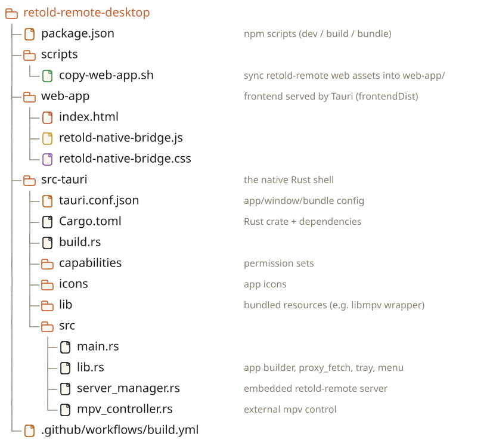

# Desktop Build & Package

This page covers building and packaging `retold-remote-desktop` for macOS, Windows, and Linux -- both locally and through the project's CI pipeline.

## Prerequisites

- **Node.js 20+** and npm
- **Rust** (stable) and Cargo -- install via [rustup](https://rustup.rs/)
- **Tauri platform dependencies** -- see the [Tauri prerequisites guide](https://v2.tauri.app/start/prerequisites/):
  - **macOS** -- Xcode Command Line Tools (`xcode-select --install`)
  - **Windows** -- the Microsoft C++ Build Tools and the WebView2 runtime
  - **Linux** -- `libwebkit2gtk-4.1-dev`, `libgtk-3-dev`, `libayatana-appindicator3-dev`, `librsvg2-dev`
- **mpv** (optional) for native video playback at runtime
- A built [`retold-remote`](https://fable-retold.github.io/retold-remote/) checkout to source the web assets from

## 1. Project Layout at a Glance

<!-- bespoke diagram: edit diagrams/1-project-layout-at-a-glance.mmd or .hints.json, then: npx pict-renderer-graph build modules/apps/retold-remote-desktop/docs -->


## 2. Build a Web Bundle First

The Tauri build serves the static `web-app/` directory (`frontendDist: "../web-app"` in `tauri.conf.json`). Before bundling, sync the latest `retold-remote` assets in:

```bash
npm run copy-web-app
```

`scripts/copy-web-app.sh` copies `retold-remote`'s built assets from `../retold-remote/web-application/` -- the JS bundles, `js/`, `css/`, and `docs/`. It deliberately leaves `index.html`, `retold-native-bridge.js`, and `retold-native-bridge.css` untouched. If the sibling bundle hasn't been built, build it first (`cd ../retold-remote && npm install && npm run build`).

## 3. Development Build

```bash
npm run dev
```

This runs `tauri dev`, which compiles the Rust crate, serves `web-app/`, and opens a native window with live reload. The script passes an inline config override making the main window `transparent: true` (so the embedded macOS video layer can show through). The first compile downloads and builds all Rust dependencies and can take several minutes; subsequent runs are incremental.

## 4. Production Bundles

The npm scripts wrap `tauri build`. Each produces a signed-or-unsigned native bundle for the target platform under `src-tauri/target/.../bundle/`.

| Script | Command | Output |
|---|---|---|
| `npm run build` | `tauri build` | Default bundle for the host platform |
| `npm run build-mac` | `tauri build --target universal-apple-darwin` (+ transparent window) | Universal macOS `.app` / `.dmg` |
| `npm run build-win` | `tauri build --bundles msi` | Windows `.msi` installer |
| `npm run build-linux` | `tauri build --bundles deb appimage` | Linux `.deb` and `.AppImage` |

You generally build each platform's bundle **on that platform** (or in CI -- see below). The macOS universal target requires both `aarch64-apple-darwin` and `x86_64-apple-darwin` Rust targets installed (`rustup target add ...`).

The release profile in `Cargo.toml` is tuned for size and speed: `strip = true`, `lto = true`, `codegen-units = 1`, `panic = "abort"`. Expect release builds to take noticeably longer than dev builds because of LTO.

## 5. What Gets Bundled

From `tauri.conf.json`:

- **productName** `Retold Remote`, **identifier** `com.retold.remote-desktop`
- **icons** -- the PNG/ICNS/ICO set under `src-tauri/icons/`
- **resources** -- `lib/**/*` is bundled into the app (this is where the libmpv wrapper for macOS lives)
- **plugins** -- `shell.open` is enabled so the app can hand URLs to the OS

Platform notes:

- **macOS** -- embedded libmpv is compiled in (the `tauri-plugin-libmpv` dependency is gated to `cfg(target_os = "macos")` in `Cargo.toml`, and the `macos-libmpv` capability is platform-scoped). The `lib/libmpv-wrapper.dylib` resource ships in the bundle.
- **Windows / Linux** -- no embedded libmpv; native video uses an external `mpv` process if installed.

## 6. Continuous Integration

`.github/workflows/build.yml` builds on push to `main`, on `v*` tags, on pull requests, and via manual dispatch. It runs in two stages:

### Stage 1 -- `web-assets` (Ubuntu)

Web assets are built **once** on Linux (the comment notes quack/gulp has path issues on Windows):

1. Check out this repo.
2. Check out `stevenvelozo/retold-remote` into `_retold-remote`.
3. `npm install` and `npx quack build` inside `_retold-remote`.
4. Copy the generated assets into `web-app/` (the same set `copy-web-app.sh` handles).
5. Upload `web-app/` as the `web-assets` artifact.

### Stage 2 -- `build` (matrix)

A matrix builds the native bundles, downloading the `web-assets` artifact first so every platform shares one web build:

| Platform runner | Args | Rust targets |
|---|---|---|
| `macos-latest` | `--target universal-apple-darwin` (+ transparent window) | `aarch64-apple-darwin,x86_64-apple-darwin` |
| `windows-latest` | `--bundles msi` | (host) |
| `ubuntu-22.04` | `--bundles deb appimage` | (host) |

Each job installs the Linux system dependencies where needed, sets up the Rust toolchain (with a `swatinem/rust-cache` on `src-tauri -> target`), runs `npm install`, then builds with `tauri-apps/tauri-action@v0` (`tauriScript: npx tauri`). The resulting `.dmg`, `.app`, `.msi`, `.deb`, and `.AppImage` files are uploaded as per-platform `bundle-<platform>` artifacts.

## 7. Troubleshooting

| Problem | Fix |
|---|---|
| `copy-web-app` errors: `retold-remote web-application/ not found` | Build the sibling first: `cd ../retold-remote && npm install && npm run build`. |
| First `tauri dev` / `tauri build` is extremely slow | Normal -- it compiles all Rust dependencies. Subsequent builds are incremental; CI caches `src-tauri/target`. |
| Linux build fails on missing `.so` / `webkit2gtk` | Install the system packages listed under Prerequisites. |
| macOS universal build fails to link | Add the Rust targets: `rustup target add aarch64-apple-darwin x86_64-apple-darwin`. |
| Native video does nothing on Windows/Linux | Install `mpv` and ensure it is on `PATH`; otherwise playback falls back to the in-browser player. |
| "Open local folder" reports the server could not start | Ensure `retold-remote` is resolvable -- on `PATH`, or installed so `node -e require('retold-remote/...')` works (see the `server_manager` fallback). |

## 8. Reference Commands

```bash
# Sync the web bundle
npm run copy-web-app

# Develop with live reload
npm run dev

# Build for the host platform
npm run build

# Per-platform bundles
npm run build-mac
npm run build-win
npm run build-linux

# Invoke the Tauri CLI directly
npm run tauri -- --help

# Add macOS universal Rust targets (one-time)
rustup target add aarch64-apple-darwin x86_64-apple-darwin
```
