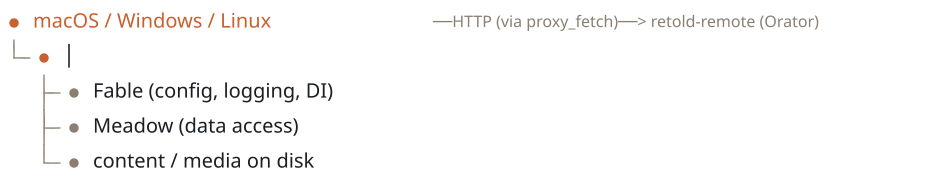

# Overview

`retold-remote-desktop` is the native desktop companion to the `retold-remote` server and web app. It brings the Retold Remote media browser -- image galleries, video, audio, ebooks, and documents -- into a first-class native window on macOS, Windows, and Linux, built with [Tauri 2.0](https://v2.tauri.app/).

## What It Is

A thin native shell around an unmodified web app. The browsing experience -- views, navigation, rendering -- is the same `retold-remote` Pict application that runs in a browser. The desktop app is responsible for:

- Hosting the `retold-remote` web bundle in a native Tauri WebView
- Brokering the web app's HTTP calls through a Rust proxy so cross-origin requests work without CORS headers
- Letting you connect to a remote `retold-remote` server, or spawn a local one pointed at a folder on disk
- Launching native video playback (mpv) for full codec support beyond what the WebView can decode
- Providing native chrome: a system tray, an application menu, and window-state persistence

## What It Is Not

- **Not a server.** It consumes a `retold-remote` server's API; it does not implement endpoints. When you "open a local folder," it *spawns* a real `retold-remote` server process to do the serving.
- **Not a fork of the web app.** The `retold-remote` browser bundle is copied in verbatim and wrapped. A separate bridge script adapts it to the native environment without editing it.
- **Not a media transcoder.** Native playback hands the media URL to mpv; the app itself does not decode or convert anything.

## Core Capabilities

| Capability | Backed By |
|---|---|
| Media browsing UI | The `retold-remote` web bundle in `web-app/` |
| CORS-free API and content requests | Rust `proxy_fetch` command (`reqwest`) |
| Connect to a remote server | Native bridge connection screen + saved-server list |
| Serve a local folder | Rust `start_server` command spawning `retold-remote serve` |
| Native video playback | Embedded libmpv (macOS) or an external `mpv` process |
| System tray and menu | Tauri tray + menu APIs in `src-tauri/src/lib.rs` |
| Window position/size persistence | `tauri-plugin-window-state` |

## Platform Support

- **macOS** -- universal binary (Apple Silicon + Intel); embedded libmpv is macOS-only.
- **Windows** -- MSI installer; uses WebView2.
- **Linux** -- `.deb` and AppImage; uses WebKitGTK.

Native video playback uses embedded libmpv on macOS (rendering behind a transparent WebView). On Windows and Linux it falls back to launching an external `mpv` process, then to in-browser playback if mpv is not installed.

## Relationship to the Rest of the Ecosystem

The desktop app is an outer edge of a Retold deployment. It talks to one thing -- a `retold-remote` server -- which brokers everything else.

<!-- bespoke diagram: edit diagrams/relationship-to-the-rest-of-the-ecosystem.mmd or .hints.json, then: npx pict-renderer-graph build modules/apps/retold-remote-desktop/docs -->

It shares its native bridge script with the [`retold-remote-ios`](https://fable-retold.github.io/retold-remote-ios/) client: the same code detects whether it is running under Tauri (desktop) or Capacitor (iOS) and adapts accordingly.

See the [Architecture](#/page/architecture.md) page for a full diagram.
